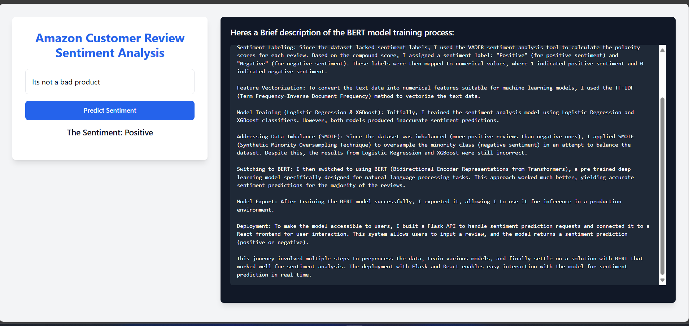

# Sentiment Analysis Web Application using BERT, Flask, and React

This project showcases a comprehensive approach to **sentiment analysis** of Amazon customer reviews, utilizing advanced NLP techniques and various machine learning models.

## 🔑 Key Features:

- **Model Training with XGBoost & Logistic Regression**: Implemented **XGBoost** and **Logistic Regression** models for sentiment classification.
- **Text Processing & Labeling**: Preprocessed review text using **NLTK** and labeled the sentiment with **VADER sentiment analysis**.
- **BERT Model Training**: Shifted to **BERT** for superior accuracy after initial attempts with traditional models. Fine-tuned a **pre-trained BERT model** for optimal performance.
- **Deployment**: Integrated a **Flask server** with **React** frontend for user interaction. The Flask server processes sentiment predictions, while React serves as the interface for real-time inputs.
- **Traditional HTML & JS Setup**: Developed a traditional **HTML/JS setup** for simpler engagement (Flask server-client communication).

## 🧑‍💻 Important Notes:

- The **trained BERT model** file size is approximately **400MB**, and it is not uploaded. **Contact me** if you would like access to the model.
- **SMOTE** was applied to address **data imbalance** during training, but **BERT** ultimately provided the most accurate predictions.

## 🛠️ Tech Stack:

- **Data Processing**: Python (NLTK, VADER)
- **Models**: XGBoost, Logistic Regression, BERT
- **Backend**: Flask
- **Frontend**: React, Tailwind CSS
- **Traditional Setup**: HTML, JS

## Project Workflow:

1. **Data Preprocessing**: Cleaned the text data using **NLTK** and used **VADER sentiment analysis** to label sentiment.
2. **Model Training**: Initially trained with **XGBoost** and **Logistic Regression**, but shifted to **BERT** for better accuracy.
3. **Deployment**: Created a **Flask API** to handle sentiment prediction requests and integrated it with a **React** frontend for interactive use.

This project **demonstrates end-to-end workflow** from data preprocessing, model training (Logistic Regression, XGBoost, BERT), to deployment using Flask and React. **Real-time sentiment prediction** is now possible, giving users an interactive way to analyze customer reviews.
